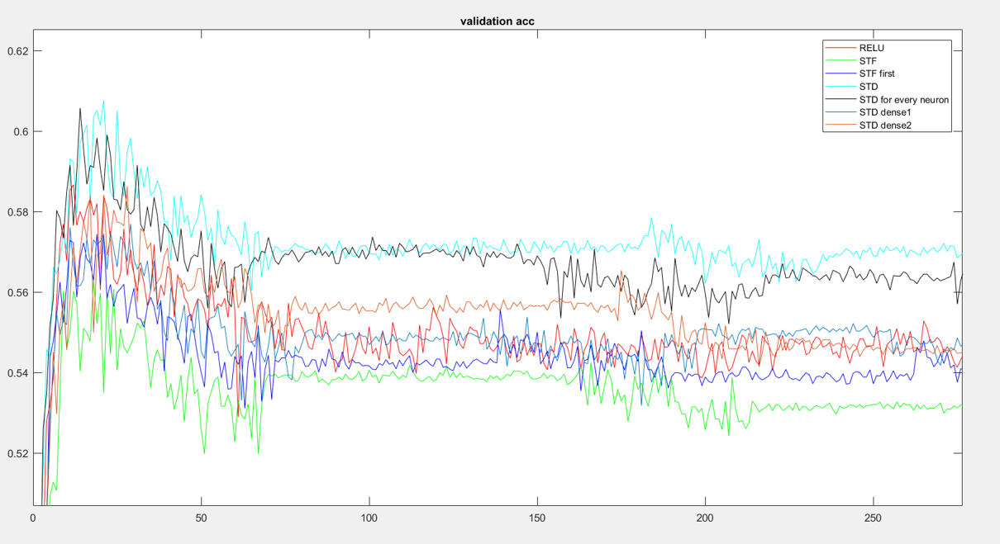

#  Short term plasticity

## neural science and neural network
 At the earlier era of machine learning, most ideas were get inspired by mathematics. During developing, researchers started to cultivate the treasure hidden in the neuron science. One of the most common activation function 'Relu' [[1]](https://www.cs.toronto.edu/~hinton/absps/reluICML.pdf) is the created on the basis of neuron spike-fire model. The long-short term memory network (LSTM) was also inspired by the true phenomenon happened in the neural system. Moreover, there is new kinds of neural network named spike neural network, which is also be considered as the third generation of neural network. Even though this kind of network could perform better than the current network in all task, it does shows better approximation on real neuron and show some potential. Right now, there are also algorithms and methods aiming to make the transformation between traditional neural network to spike neural network in both direction [[2]](https://www.frontiersin.org/articles/10.3389/fnins.2016.00508/full).

## Introduction
This blog is mainly discuss an common and important phenomenon in the neural system, which is short term plasticity. Short-term plasticity (STP), also called dynamical synapse, refers to a phenomenon in which synaptic efficacy changes over time in a way that reflects the history of presynaptic activity. Two types of STP, with opposite effects on synaptic efficacy, have been observed in experiments. They are known as Short-Term Depression (STD) and Short-Term Facilitation (STF). Synapses in different cortical areas can have varied forms of plasticity, being either STD-dominated, STF-dominated, or showing a mixture of both forms. Although STP appears to be an unavoidable consequence of synaptic physiology, theoretical studies suggest that its role in brain functions can be profound. From a computational point of view, the time scale of STP lies between fast neural signaling (on the order of milliseconds) and experience-induced learning (on the order of minutes or more). This is the time scale of many processes that occur in daily life, for example motor control, speech recognition and working memory. It is therefore plausible that STP might serve as a neural substrate for processing of temporal information on the relevant time scales. STP implies that the response of a post-synaptic neuron depends of the history of presynaptic activity, creating information that in principle can be extracted and used. In a large-size network, STP can greatly enrich the network's dynamical behaviors, endowing the neural system with information processing capacities that would be difficult to implement using static connections. These possibilities have led to significant interest in the computational functions of STP within the field of Computational Neuroscience. 

$$\frac{du}{dt}=-\frac{u}{\tau_f} + U(1-u^-) \delta  ( t  -  \eta  ) $$

$$\frac{dx}{dt}=-\frac{1-x}{\tau_d} + u^+ x^- \delta (t - \eta) $$

$$\frac{dI}{dt}=-\frac{I}{\tau_s} + Au^+x^-\delta(t-\eta) $$

$$\triangle I(\eta) = Au^+x^-$$

\\(u^-\\) and \\(x^-\\) denotes the corresponding variables value before the arrival of the spike, and the \\(u^+\\) refers to the value at the moment just after the spike.
\\(\eta\\)  means the time spike arrives at post synapse.  The diagram of this phenomenon model can be shown below:

If we don't consider the current \\(I\\) decay with time. We can have 

$$I[n] = AR[n] (1-u[n])(u[n]+f(1-u[n]))$$

$$R[n+1] = 1- (1-R[n] (1-u[n] ))e^\frac{-t}{D} $$

$$u[n+1] = U + (u[n] + f(1-u[n]) -U)e^\frac{t}{F} $$

Because STP modifies synaptic efficacy based on the history of presynaptic activity, it can alter neural information transmission. In general, an STD-dominated synapse favors information transfer for low firing rates, since high-frequency spikes rapidly deactivate the synapse. An STF-dominated synapse, however, trends to optimize information transfer for high-frequency bursts, which increase the synaptic strength.

## Methods
Because the common artificial neural network we usually use don't have the frequency concept. So we decide to consider the average firing number in the neuron to be the amplitude we used in common neural network. To do this, we have to model how the neuron fire in the real neuron. To make it simple, we use the simplest model to describe the fire.

$$\frac{d V_m}{dt}C=I$$

From the ordinary differential equation above, we can have the function below:

$$V_m =\frac{I}{C}t $$

Assuming the synaptic need time T to achieve the threshold \\(\theta\\), we can get

$$ V_m(T) = \frac{I}{C}T=\theta$$

$$ \frac{I}{C_m \theta} = \frac{1}{T}=frequency $$

we can see that the frequency is all depend on the current \\(I\\) in the presynaptic

$$\sum_{i=1}^{n}t[i] (R[n] (1-u[n])) (u[n] + f(1-u[n])) = I(average) $$

$$\begin {case}
  \sum_{i=1}^{n} t[i] \leq T \\\

  \sim_{I=1}^{n+1} t[i] > T
\end{case}
$$

\\(t[n]\\) in the function above can be generated using exponential distribution to show the time cost for the spike come from pre-synapse. 

By using the function above, choosing different parameters \\( \tau_f \\) and \\( \tau_d \\)for STP  we can generate the STF and STD frequency and current \\(I\\) function.

## Experiments 

We propose using new activation functions and use it to replace Relu function. We use exponential function to approximate the short-term facilitation function 

$$y = max(0, x^b)$$

and use logarithmic function to approximate the short-term depression function

$$y = log(x+b)$$

The parameter to generate the figure above is :

| neuron | U0    | \\(\tau_d\\)(s) | \\(\tau_f\\)(s) |   |
|--------|-------|--------------|--------------|---|
|  STF   | 0.016 | 0.045        | 0.376        |   |
| STD    | 0.25  | 0.706        | 0.021        |   |
|        |       |              |              |   |

Inspired by the paper  Spiking neurons with short-term synaptic plasticity frin superior generative network [[3]](https://www.nature.com/articles/s41598-018-28999-2), in our experiment, we checked whether the STP can be used to help neural network deal with the minority class problem. 

To make the model simpler to analysis, we choose the most simple LeNet5 structure to study the effect after adding this new activation function. For the data, we choose the MNIST dataset and CIFA10 dataset.

For the MINST dataset, use 1% digit 4 and digit 5 and complete data of other digits as training set. For the test set, the data is balanced.  For the CIFA10 dataset, we use 1% of class 4, class 5 and complete data of other classes as training data. The test data for CIFA10 is also balanced. 

Because we set the STP to be the activation function, we can insert it to any layer we want. In experiment, we test the model by adding the STP activation function in the location as shown below:

Also, we tested the different ways to use the activation function. For the activation after convolution layer or batch normalization layer, because convolution layer output have multiple channels. We design two methods to insert the activation function. One is to let the neuron on same channel share one activation function, other is to let every neuron have its own activation function. The latter method will increase the number of parameters of the model much more than the first method. Those methods difference can be shown in the figure below:

Also, for the training method, we test two different training procedure. First method is to training all parameter from start to an end. Other method is to first freeze the STP parameter and only train other parameters. Then, freeze other parameters and only train STP parameters. Even though, in the end, we don't find out evidence which training method is better than others, different training strategies are worth trying since the first method is what we usually used and second method are more similar to what happened in the real neural system.

First we test the result by only set the digit 5 to be minority, which means we only use 1% of digit 5 data in the training stages.
The best result of STP and baseline using Relu is shown below:
| activation function    	| max val acc 	| test acc 	| minority test acc 	| minority test acc 	|
|------------------------	|-------------	|----------	|-------------------	|-------------------	|
| Relu                   	| 0.9495      	| 0.6323   	| 0.9498            	| 0.6738            	|
| STF (by channels) 	| 0.9524      	| 0.6977   	| 0.9527            	| 0.7265            	|
| STD (by channels) 	| 0.9527      	| 0.7176   	| 0.9528            	| 0.7534            	|

We can also see how the parameters changing during training

For the CIFA10, we have the experiment result showing in the table below:
| activation function          	| max val acc 	| class 4 val acc 	| class 5 val acc 	|
|------------------------------	|-------------	|-----------------	|-----------------	|
| Relu                         	| 0.5867      	| 0.2449          	| 0.1825          	|
| STF first                    	| 0.5745      	| 0.3121          	| 0.2389          	|
| STF second                   	| 0.5631      	| 0.2809          	| 0.1968          	|
| STD second                   	| 0.6078      	| 0.3517          	| 0.2593          	|
| STD second(for every neuron) 	| 0.6058      	| 0.3289          	| 0.3025          	|
| STD dense1                   	| 0.5700      	| 0.3986          	| 0.2581          	|
| STD dense2                   	| 0.5863      	| 0.3541          	| 0.2641          	|

More detail about the result can be shown in the confusion matrix below:

## Problems

## Conclusion and future work
Through the literature research and the work we have done, we found that the activation function is far more important than we originally thought and we should pay more attentation on this. Recently, some papers ([[4]](https://arxiv.org/pdf/1606.01164.pdf),[[5]](https://arxiv.org/pdf/1701.00939.pdf))talking about the usage of activation function and their effects are quite inspiring .  

For our experiment, the model we tested are too simple comparing state-of-art model. Whether those activation function will work on much bigger neural network needs more experiment. Also, the why the STP function work in the experiment needs more theoretical analysis and more convincing mathematical analysis. In addition, the STP funtion potential ability that is used on other task like meta-learning or transfer learning is absolutely worth trying and paying more attentation. 

