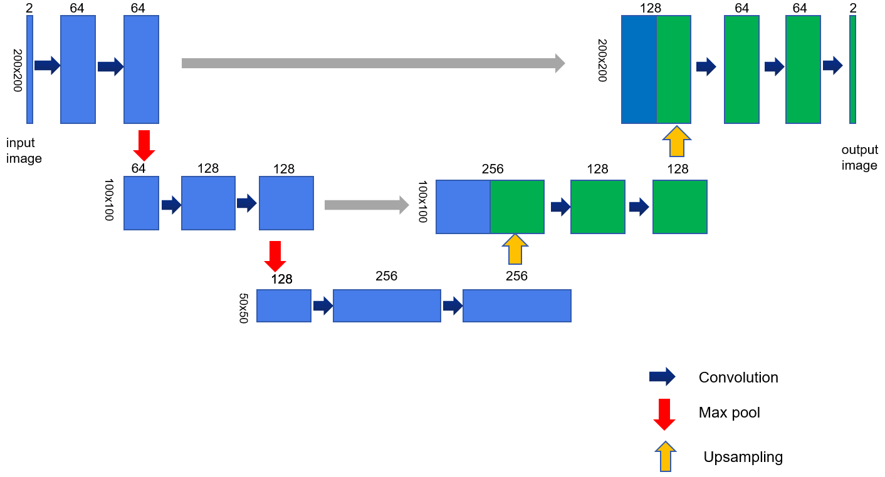
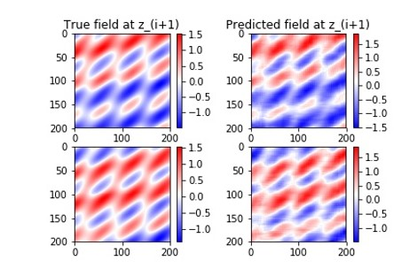
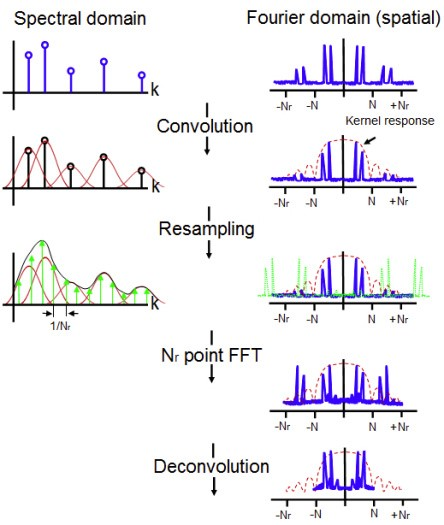
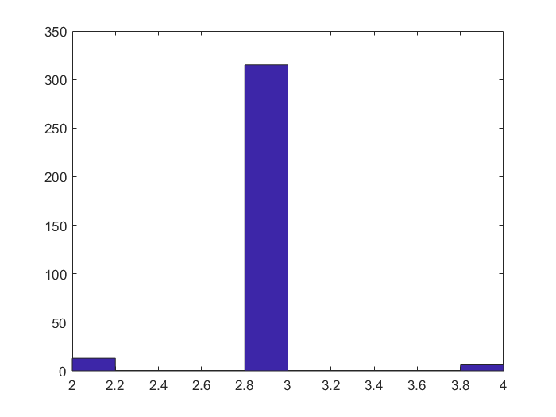

#  Wave-Optic Propagation Computation Enabled by Machine Learning Algorithms

## 1.Introduction
In simulating free-space laser wave propagation, including atmospheric propagations, a common approach is to use direct Fourier transform, where computational time and power are forced, especially for large fields to simulate. Then computational speed, in those cases, is rather slow due to the number of samples in the field. Thus, faster methods for wave-optical propagation simulations are needed and expected. 

In executing wave propagation simulation (for larger distances than wavelength), one would need to execute the Rayleigh-Sommerfeld integral, which can easily be executed by systems theory by applying two-step Fourier transforms. That is, first a Fourier transform of the field is taken, which pass the signal from spatial domain to frequency domain. Then, the wave is propagated the required distance (spatial frequency domain propagation), and then the inverse Fourier transform (IFT) is taken, which let the result goes back to spatial domain. Digitally, Fourier  transforms can be executed by discrete Fourier transforms (DFT), a discretized version of the original transform. Furthermore, the computation speed of DFT is accelerated by using Fast Fourier transform (FFT) algorithm.

To capture the laser information during propagation, we need to propagation through multiple stages. If the distance is too long, this will cost a lot of computation time.  We assume we simulate the wave-optic data as 2D discrete signal. Obviously, for simulation or calculation of propagation, less the amount of number in the data, faster the propagation will be. To reduce the number of pixel in the data, we should down-sample the signal. However, due to the limitation of Nyquist theorem, we have to make sure that the sampling frequency is higher than twice of the max frequency of the signal. If we downsample too much on the input-plane, due to the effect of aliasing, the propagation result's accuracy will decrease repidly.

## 2.Where you should use neural network

To be honest, this section should not be contained in the professional report. However, due to the hard time I have spent on the wrong method. I think to share this experience should help you have further understanding about what the current nerual network is truly was and in which part the neural network may perform better than the traditional methods. Hope this section will inspire you on your project and make better choice on how and where you apply neural network.

Intuitionly, if you are a zealous machine learning guy, the first idea come up to you maybe the use neural network to approximate the propagation. The most easiest way is to use convolution neural network. However, because the complexity of the propagation function h [[1]](https://www.sciencedirect.com/science/article/pii/S0030401809004817)
, it is hard to have a good approximation if the neural network is too simple. Use more sophisticated model like U-net or even deep-lab will give you good approximation.

 We also tested this method, the sample result is shown below:

The laser used in this experiment are mix of multiple plain waves and each of them contain different phase and frequency. Just see the result from the figure, the result is quite good and indeed even if you calcualte the mean-square-error between the approximation result and the true propagation result. 

Every thing However, if you apply neural network by this way, there exist some serious problems. First, after training the neural network, all weights/parameters in the neural networks are fixed and this required the other part of simulation is fixed. However, this is totally unacceptable because this means the propagation distance is fixed. Besides, the varity of laser itself will also cause the model perform bad. In other words, this method is not robust enough.

Next, another important reason that this method is not appropriate is the high computation and restore cost. As we know, for discrete convolution, assuming the kernel width is \\(m\\) and signal width is \\(n\\) and they are both square matrix, the computation cost is \\(o(n^2 m^2)\\), considering we have multiple convolution layers in neural network. The cost in real simulation will be more slower. However, in traditional method, if we can use angular spectrum method, which we calculate the computation in frequency domain, the computation cost will be reduced much by using Fast-Fourier-transform. In frequency domain, the free space H and the frequency response of input optic wave G are calculated by hadamard product. This means that the computation cost is only related to the number of points in the G or H and the computation time is \\(o(n^2)\\)

## 3.Methods
Based on the what we have discussed before, the key to increase the speed of calculation is to decrease number of sampling points in each stage. However, due to the Nyquist theorem limitation, when sampling frequency is not high enough, aliasing effect occurs in the frequency domain and cause the decline of calculation accuracy. 

To overcome this issue, we explore the non-uniform sampling theory and try to implement it into calculation of propagation. Usually, samples are acquired from analogic signals at a constant rate, which is well known as uniform sampling. In many cases, the non-uniform sampling is caused by the unavailability of some data and thus becomes a question need to be solved. But in other cases, non-uniform sampling is a chosen way to sample data in order to gain profit from its advantages. Random sampling is a type of non-uniform sampling used to make use of the advantage of non-uniform sampling.

Random sampling was first introduced in 1960’s [[3]](https://surveillance9.sciencesconf.org/data/151236.pdf) and then reused in Compressive Sensing for having two important advantages: anti-aliasing property and low sampling rate, which decreases the demand of high speed in data acquisition and for big data storage. Among various of methods to do the random sampling, Additive Random Sampling (ARS) and Jittered Random Sampling (JRS) are most common methods used in practice. In fact, the stationarity of the random point process in the vital criteria to guarantee the anti-aliasing property. 

### 3.1 Random sampling methods (ARS and JRS)
In uniform sampling, the n^th instant of sampling is t_n=nT, while in the random sampling t_n is a random variable controlled by some specific distribution law. 
First, the additive random sampling (ARS) was first proposed by Shapiro and Silverman in [4](H.Shapiro,S.Silverman,”Aliasing-free sampling of random noises",SIAM J. Appl. Math., vol. 8, pp. 225-236, 1960) as a sampling method providing alias-free processing of analogic signals. As its name indicates, the sampling instant in this mode is obtained by adding a random variable to its previous:

   $$t_n=t_(n-1)+τ_n     n=0,1,2….$$

Where \\(τ_n\\) are independent and identically distributed (IID)variables with a probability density  function  (PDF)=p(τ) having avariance σ^2and a mean μ. There are modified models of ARS that are introduced by [[5]](https://link.springer.com/content/pdf/10.1007%2FBF01246719.pdf) and [[6]](https://www.amazon.com/Randomized-Processing-Prentice-International-Acoustics/dp/0137510748): Hybrid ARS and Correlated RS that have same properties of ARS but a bit enhanced to provide more advantages: the HARS process reduces the calculation cost of the Discrete Fourier Transform and the CRS has better aliasing suppression. Second, the jittered random sampling (JRS) where a jitter (error) is applied to a uniform sampling grid, is a type of sampling that appears frequently in practical sampling systems because of uncertainty    of sampling clocks due to hardware imperfections [[7]](https://pastel.archives-ouvertes.fr/pastel-00004780/document). The sampling model in this case can be described by:

   $$t_n=nT_s+u_n     n=0,1,2… $$

Where \\(T_s\\) is the mean inter-sample interval and u_n are identically distributed (IID) variables with probability density function (PDF)=p(u) having variance \\(σ^2\\)and a zero mean.
The probability density function can be chosen according to the different situations, Gaussian distribution, uniform distribution and exponential distribution are most used in practice. 

### 3.2 Non-unform discrete fourier transform

To calculate frequency response of uniform sampled signal, we have discrete fourier transform as below:

X[k]=∑_(n=0)^(N-1)x[n]e^(-j 2πkn/N),      k=0,1,2…N-1 

The non-uniform Discrete-Fourier-Transform transforms a sequence of N complex numberx_0,  x_1…,x_(N-1) into another sequence of complex number X_0, X_1,…, X_(N-1) defined by

X_k=∑_(n=0)^(N-1)x_n e^(-j2πp_n f_k ) ,0≤k≤N-1                 

Where p_0,… p_(N-1)∈[0,1] are sample points and f_0,…, f_(N-1)∈[0,N] are frequencies. Note that if p_n=n/N and f_k=k, then the equation reduces to normal discrete Fourier Transform. There are three types of Non-uniform Discrete Fourier Transforms (NUDFTS):
The non-uniform discrete Fourier Transform of type I (NUDFT-I) uses uniform sample points p_n=n/N but non-uniform frequencies f_k (i.e. non-integer). This corresponds to evaluating a generalized Fourier series at equi-spaced points.
The non-uniform discrete Fourier Transform of type II (NUDFT-II) uses uniform frequencies f_k=k but non-uniform sample points p_k. This corresponds to evaluating a Fourier series at non-equi-spaced points.

The non-uniform discrete Fourier Transform of type III (NUDFT-III) uses both non-uniform sample points p_n and non-uniform frequencies f_k. This corresponds to evaluating a generalized Fourier series at non-equi-spaced points.
Among these three different types of Non-uniform Discrete Fourier Transform, NUDFT-II is what we will focus on during explore. Because we want to use non-uniform sampling method to decrease the number of sampling points in every stage. 

To make function more related to our final project. We still use 1d signal as example. Assume the original discrete signal we have is x[n],n=0,1,...N-1, and original signal is uniform sampled from the continuous signal x(t). We use methods which is mentioned in the section before to get a set of integers 
A={N_m |i=0,1,2…M-1} and A is the subset of {n|n=0,1,2…N-1}. N_M≤N and M≤N. Use NUDFT-II we can calculate the Fourier series of new signal x[N_m ],m=0,1,…M-1 as:

X_k=∑_(m=0)^(M-1)x[N_m ]e^(-j2πk N_m/N),k=0,1,2…M-1          

### 3.3 Non-uniform fast fourier transform
Even though we have lower sampling number by using the non-uniform sampling method, if we use the discrete-Fourier-Transform the speed is quite slow because the computation complexity of DFT is o(n^2), n is the number of sampling points. In uniform sampled signal, we can use Fast-Fourier-Transform to accelerate the speed. To make fast calculation of non-uniform signal, the NUFFT is invented. 
NUFFT is a fast algorithm that approximates NDFT. Its steps are summarized in the following:
1) Convolve the non-uniformly sampled k domain data with a kernel function.

2) Resample the result onto evenly spaced locations on an oversampled grid.

3) Compute the Fourier transform using an FFT on the oversampled data.

4) Apply a deconvolution in the z domain by a division of the FT of the kernel function (also known as apodization correction or de-apodization).
The speed and accuracy of the NUFFT algorithm can be adjusted by modifying the oversampling ratio and the kernel width. The choice of kernel is also a determining factor in reconstruction accuracy. O’Sullivan noted that the optimal kernel is the infinite length sinc function [[8]](https://www.ncbi.nlm.nih.gov/pubmed/18243972) but kernel functions are typically evaluated only for a finite length for computational practicality.

    

In order to choose the optimum parameters and kernel function, their effects on processing time must be also considered. The total complexity of the NUFFT is dependent on kernel width and the oversampling ratio and is given as 

$$o[pWN+RNlog_2 (RN)+N]   $$

Where p is constant decide by the kernel function, W is the kernel width, N is the number of points in non-uniform signal and R is the over-sampling ratio. The terms in the above notation represent the convolution-resampling steps, oversampled FFT and the apodization correction respectively. It can be seen that the oversampling ratio R has a larger effect on the complexity than the kernel width. Therefore, it is desirable to use the lowest oversampling ratio together with the appropriate kernel width to achieve the desired accuracy. FFT algorithms are often more efficient at calculating vectors with a power of two number of elements. To obtain best efficiency, designers should therefore choose a minimum oversampling ratio R>1 that will give a power of two sized oversampled array based on the hardware.

## Experiments

We simulate multiple stages of propagation, with input that is a 1D Gaussian-enveloped sum of M = 5 plane waves. The parameters for this simulation are:

λ="0.5"×"1" "0" ^"-3"   mm

w_x=w_y=√π  mm

ϕ_2∈[0,2π] rad

θ_z∈[0,100]  μrad

L=10 mm

A∈[0.01,1]

cos^2⁡( θ_z)+cos^2⁡(θ_x)=1

α=cos⁡( θ_x)

γ=cos⁡( θ_z)

φ_1^((m))∈[0,2π]

sampling _⁡r ate=L/"1000"

∆z=z_(i+1)-z_i=1000 mm

In which the lateral extent of input and output planes of this propagation stage is L×L. The propagation distance ∆z is set to be 1 meter. For the random sampling, we choose Additive-Random-Sampling (ARS) to get the non-uniform sampling. For the parameters in ARS are set as:

T_s=3

R=D/T_s =0.5

σ=T_s  R/6

Because the majority of value of Gaussian distribution are in the set between [-3σ,3σ], so we set the standard deviation like this. To avoid the negative sampling value, we can add ad-hoc procedure after the sampling.
To mention that, because original signal is discrete signal and all spatial index are integer, we have to quantize the sampling value after we sample from the gaussian distribution. In real experiment, the non-uniform sampling gap can be shown as below:
 

Therefore, the distribution of τ will not be Gaussian distribution again and this will cause problem like introducing high frequency noise. By using high order interpolation method such as cubic spline interpolation or polynomial interpolation may give better quality result. More study about interpolation methods are investigating.

For one experiment, the maximum frequency of the signal is 1857.2Hz and our sampling frequency is 10000Hz. Therefore, the max down sampling ratio for uniform sampling is around 2.6 and 2 in integer. If we exceed this down sampling ratio, the Nyquist rule is disobeyed and the result’s quality will be affected greatly.
To make the comparison, we also calculated the result by using valid uniform down-sampling and invalid uniform down-sampling. Valid uniform down-sampling means the max sampling frequency still obey Nyquist theorem and invalid uniform down-sampling means it exceed the max down-sample ratio. 
The result of one stage propagation is shown below:
 

We can see from this experiment result that, even though non-uniform sampling result and invalid down sampling (down sampling ratio too large to break the Nyquist theorem) both have high frequency noise, the non-uniform sampling result suffers less from high frequency noise and closer to the original signal. When the down-sampling ratio break the Nyquist theorem, even the shape of the signal is different from the exact result. Comparing to the Non-uniform sampling, even though the quality of the signal still low, but it keeps tracking the approximate shape of the signal. We hope by using method like interpolation or other post-processing method can help to improve the accuracy of the non-uniform sampling result.
More experiments need to be done to make sure the robustness of the non-uniform sampling and more methods to increase quality of non-uniform sampling method in the future research. In next step we plan to do more experiment and research on better recovery of the non-uniform sampling calculation result and try to combine the machine learning method by using it to find the better kernel function used in Non-uniform Fast Fourier Transformation.

