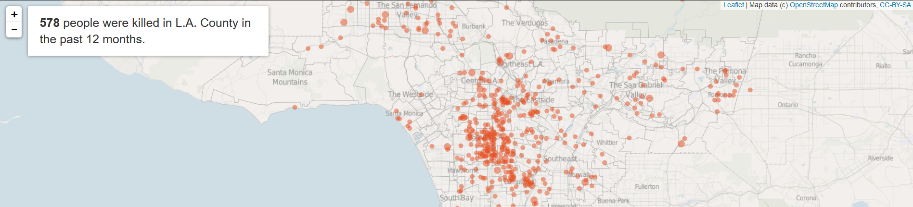
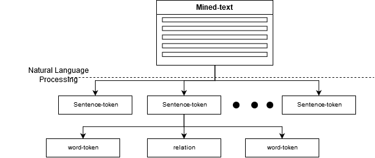
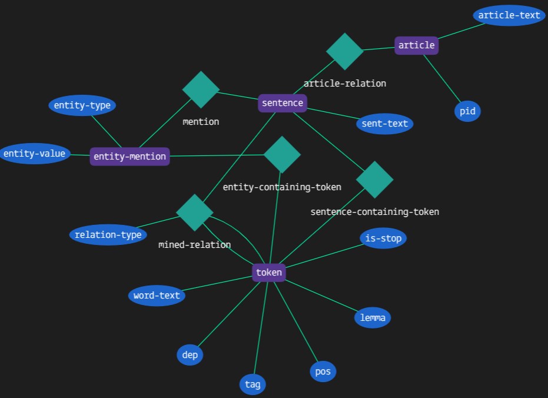
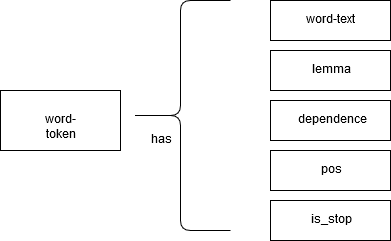
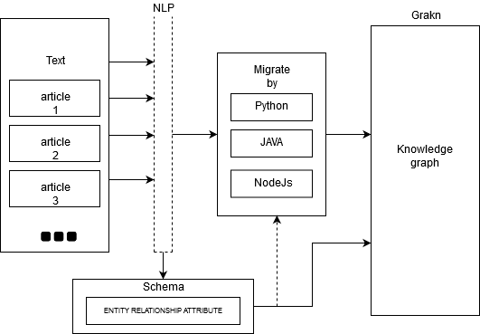
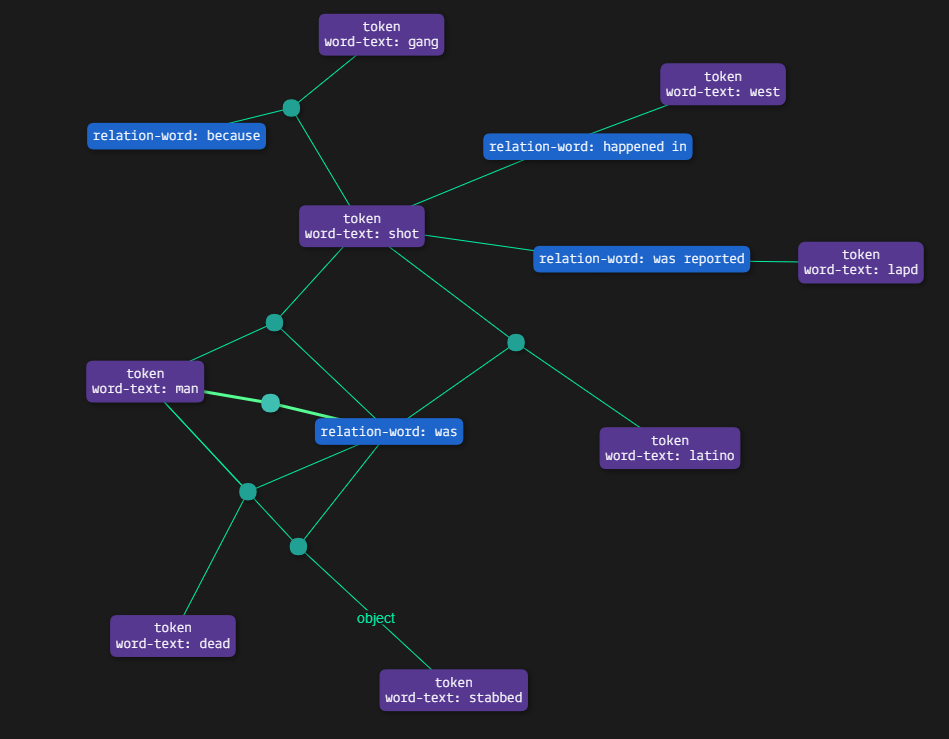
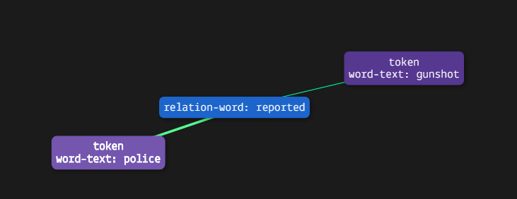

# Contextual Understanding of Homicide Reports in Los Angeles County

## Introduction
The proximate causes of crime are certainly complex. Not only are there physical processes that bring offenders and victims together in particular environmental settings conducive to crime, but there are also varied motivational processes that drive offender and victim actions. There are different patterns for different crimes. For example, the motivations and environment will be different. For non-expert people, it is hard to spend time studying so many different homicide crime and speculating latent similarity. To help normal people understand the crime easier. We apply developed natural language processing method to extract information and visualize crime articles to interpret them without helping from domain experts. We hope this technology may be useful for developing approaches to both preventing and solving crimes.

It it common to think of crimes in categorical terms. A city reports the number of homicides, robberies or burglaries that occur each year. Such categorization potentially masks significant variability within individual crime types. Two crimes that bear the same label might occur in wholly different environmental settings and involve radically divergent motives. For example, an alcohol-fueled argument that results in a man beating his girlfriend to death will typically be classified as a murder right alongside a gangland shooting death. It seems obvious that the appropriate approach to domestic violence needs to be very different from the way one deals with gangs. However, such distinctions are not always clear. For example, if close inspection of the gangland shooting shows that it stemmed from an love-triangle, then the distinction between domestic violence and gang motivation seems less robust. We suggest that mapping the situational and motivational variability in crime may be important for developing approaches to preventing and solving crime. 

## Methods
To do the text mining, we use text-mining tool of ‘NLTK’ and ‘SpaCy’ to extract the information from the descriptions of homicide.  Other packages like ‘gesim’ , ‘CoreNLP’could also be used.
By applying NLP tool, we extract the sentence-token, word-token, entities and their relationship from the original documents. The extracted information and their relationship can be shown in the figure below:
 

After drawing information, we use the tool named ‘Grakn’ to build the knowledge graph. ‘Grakn’ utilizes ‘entity-relationship model’ to group each concept into either entity, attribute or relationship. As shown in the figure above, the ‘Mined-Text’, ‘Sentence’-token and ‘word-token’ will be set into the entity in ‘Grakn’ and ‘Relation’ will be set in the relationship. Other information like token’s lemma or dependency will be set as attributes of token entity in ‘Grakn’. Beside, not only entity can have attribute, the relationship can also have attribute such as setting the relationship type as an attribute of relationship.

According to the figure before, we have 3 different relation, relation between mined-text and sentences; relation between sentences and word-token; relation between word-token. By using the relation between mined-text and sentences, we can easily find one specific sentence come from which article. By using relation between sentences and word-token, we can find all the sentences that containing certain word. The relation between token tells use the relationship between two tokens, to be clear that, not all two tokens have relation. We can show the entities and relationship in ‘Grakn’ in more detail as the figure below:
 

Entity is shown in purple rectangle, attribute is shown in blue oval and relation is shown in green diamond.
Word-token has many attributes that we can use to decide the relation between two word-token. The attributes of token are shown below:

 

 
We start with the text which can come from multiple sources and in various formats. An NLP tool is used to mine the text and produce some sort of output with a structure. That structure is used to create a schema (high level data model) to enforce a structure on the raw NLP output. Once that is done, we use one of Grakn’s clients to migrate the instances of NLP output into Grakn making sure every insertion adheres to the schema. Grakn stores this in its knowledge representation system, which can be queried for insights to discover complex concepts or even test out hypotheses.
The whole procedure can be shown below:

## Experiment

The above procedure can extract information from one article individually and can let us quickly know the information such as the location and the cause of the homicide.  
Some result can be shown below:

## Conclusion

The method talking above couldn’t give us more abstract information like what’s the similar pattern for specific kinds crime. Because it extracts subject word, object word and their relationship for one article rather finding potential keyword for a list of articles
